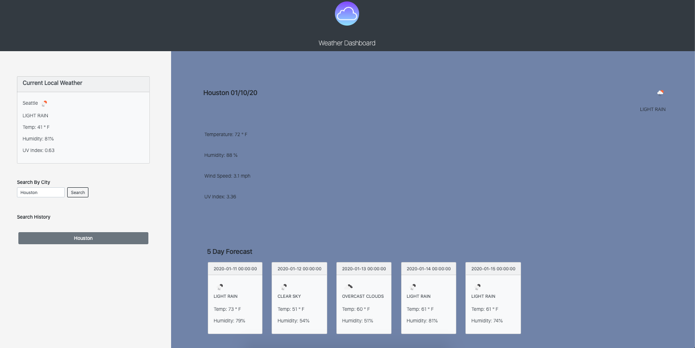

# Weather Dashboard

Weather Dashboard is an application that allows users to search the current and five day weather forecast for a searched city. It also dynamically creates a button for each city seached so that users may quickly and efficiently navigate to view the weather in various cities at once.

View application: [Weather Dashboard](https://kaitlyncarlson.github.io/Weather-Dashboard/ "Weather Dashboard")

## Purpose

To create a useful application for users who need quick access to the weather, current or weekly, forecast in multiple cities across the world.

## Functionality

In its current state this application operates on two major events. First, when the page loads the user is prompted by the browser to access user location. When the user consents the Geolocation API is triggered to gain the user's IP address location, and then Open Weather Map API is utilized to dynamically display the user's current weather within the HTML of the current weather card.

And then, an on click event. By clicking the city search button, 3 actions are triggered. A button is created for the city and appended to the search history element.

Open Weather Maps is queried for the searched location's current weather data. A seperate query is utilized in order to GET the current UV Index. This data is then dynamically rendered in the HTML.

Open Weather Maps is also queried for the five day forecast of the searched city. This data is also dynamicallly created and appended to the cards below the search city's current weather display.

## Known Bugs

1. Five day forecast is not pulling the median temperature of the day but rather the temp at the start of the day. The returned array needs to be iterated over, an equation built utilizing the values to create an average temperature.
2. Buttons are not active yet in rendering weather data quickly for users. Code needs to be cleaned up and some actions seperated in order to achieve optimal quick display.
3. Local storage needs to be added so that weather data remains when user navigates away. Also set the last searched city as the default on page load.
4. The current local weather card has a slow load time. Investigate ways to quicken the call to Geolocation and then OpenWeatherMap APIs.
